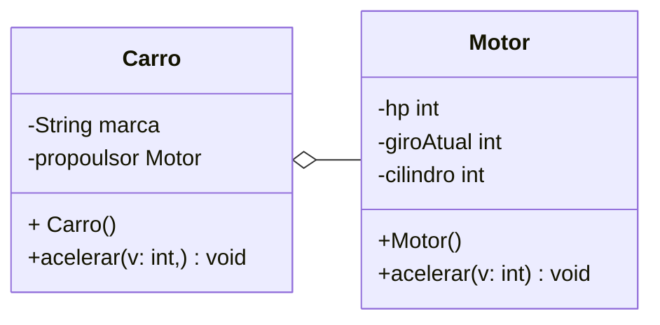

# Diagrama de classes UML

## codigo java

```java
public class Pessoa{
private String nome;
}
```
## Diagrama UML


```mermaid
classDiagram
    class Carro {
        -String marca
        -propoulsor Motor
        + Carro()
        +acelerar(v: int,) void
    }
    
    class Motor{
        -hp int
        -giroAtual int
        -cilindro int
        +Motor()
        +acelerar(v: int) void
    }
    direction LR
    
    Carro o-- Motor
```


