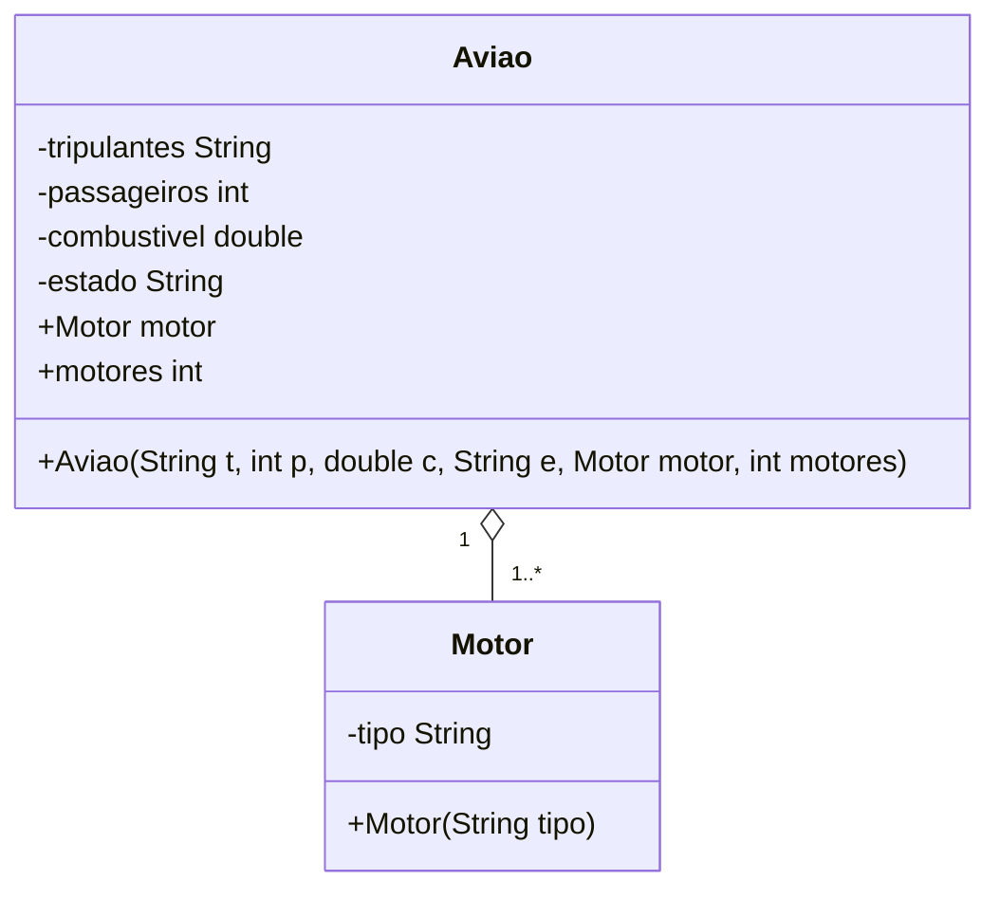

#  Diagrama de classe UML

## Aviao

```mermaid
classDiagram
    class Aviao{
        -tripulantes String
        -passageiros int
        -combustivel double
        -estado String
        +Motor motor
        +motores int
        +Aviao(String t, int p, double c, String e, Motor motor, int motores)
    }
    
    class Motor{
        -tipo String
        +Motor(String tipo)
    }
    
    Aviao "1"o--"1..*"Motor
```