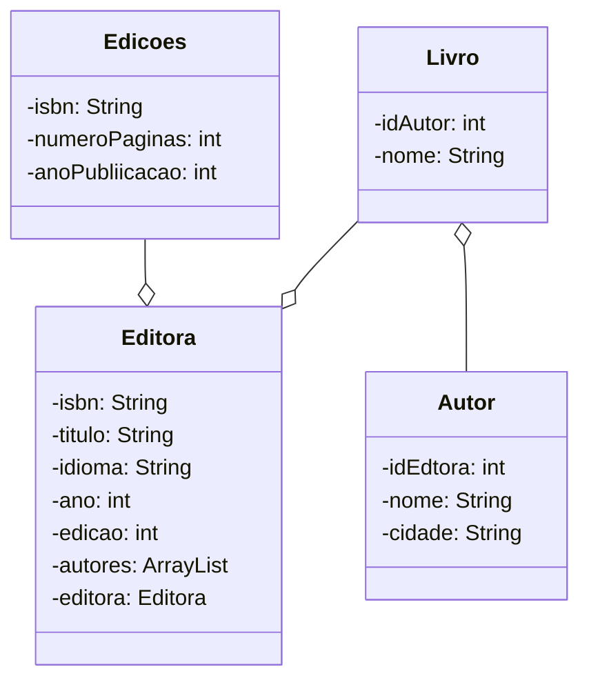
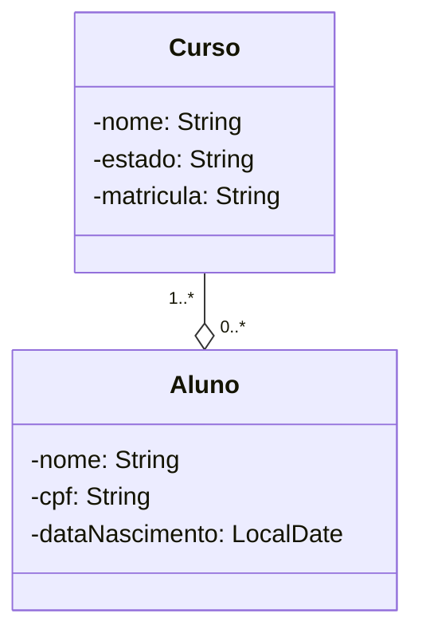
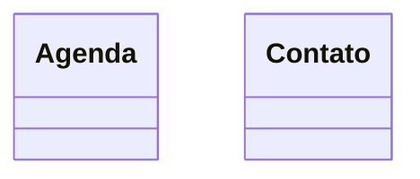

## Exercicio 1

```mermaid
classDiagram
    
    class Livro{
        -idAutor: int
        -nome: String
    }
    
    class Editora{
        -isbn: String
        -titulo: String
        -idioma: String
        -ano: int
        -edicao: int
        -autores: ArrayList<Autor>
        -editora: Editora
        
    }
    Livro --o Editora
    
    class Autor{
        -idEdtora: int
        -nome: String
        -cidade: String
    }
    
    Livro o-- Autor
    
    class Edicoes{
        -isbn: String
        -numeroPaginas: int
        -anoPubliicacao: int
    }
    
Edicoes --o Editora
```
## Exercicio 2

```mermaid
classDiagram
    
    class Aluno{
        -nome: String
        -cpf: String
        -dataNascimento: LocalDate
    }
    
    class Curso{
        -nome: String
        -estado: String
        -matricula: String
        
        
    }
   
    Curso "1..*"--o"0..*" Aluno
```

```mermaid
classDiagram
    class Agenda{
        
    }
    
    class Contato{
        
    }
    
    
```