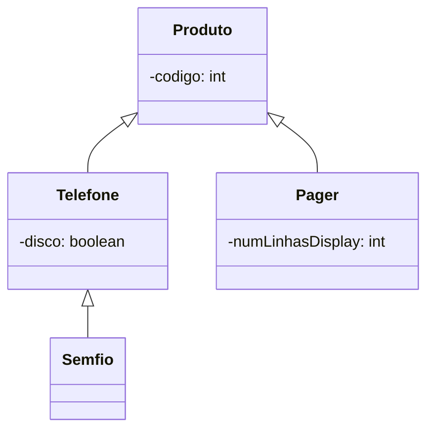

```mermaid
classDiagram
    direction BT
    
    class Produto{
        -codigo: int
    }
    
    class Pager{
        -numLinhasDisplay: int
    }
    
    class Telefone{
        -disco: boolean
    }
    
    class Semfio{
        
 }
 
 Semfio --|> Telefone 
 
 Telefone --|> Produto
 Pager --|> Produto
 
```
